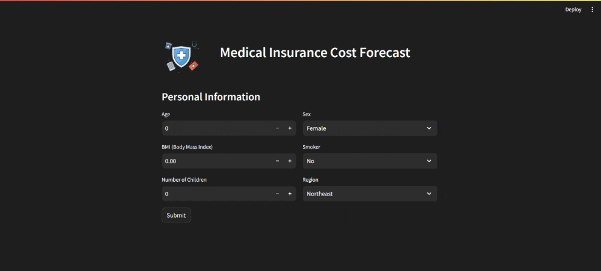

# ⚕️ MEDICAL INSURANCE COST FORECAST

The Medical Insurance Cost Forecast Model utilizes machine learning techniques to predict insurance costs based on individual characteristics such as age, sex, BMI, number of children, smoking status, and region. Deployed using Streamlit, the application offers an intuitive interface for users to input their information and receive instant insurance cost predictions.

## Preview



## Working of the Project

The **Medical Insurance Cost Forecast Model** is designed to assist individuals in estimating their medical insurance expenses by analyzing various factors affecting insurance premiums.

### Data Collection and Preprocessing

1. **Dataset:** Utilized a comprehensive dataset containing historical insurance data, including attributes such as age, sex, BMI, and insurance costs.

2. **Feature Engineering:** Preprocessed the data by handling missing values, encoding categorical variables, and scaling numerical features to prepare it for model training.

### Machine Learning Model

3. **Model Selection:** Employed a linear regression model to train the insurance cost prediction model due to its simplicity and interpretability.

4. **Model Training:** Trained the linear regression model on the preprocessed dataset to learn relationships between input features and insurance costs.

### User Interaction

5. **Streamlit Interface:** Developed an interactive user interface using Streamlit, allowing users to input their personal details and receive real-time insurance cost predictions.

6. **Cost Prediction:** Upon user submission, the application processes the input data using the trained linear regression model to predict the individual's expected medical insurance costs.

This project aims to provide individuals with a convenient tool for estimating their potential medical insurance costs, enabling them to make informed decisions about their insurance coverage.

## How to Run the Project

Follow these steps to set up and run the project locally:

1. **Clone the Repository:**
   Clone this repository to your local machine.

    ```bash
    git clone https://github.com/drstrange102/Medical-Insurace-Cost-Forecast.git
    ```

2. **Install Dependencies:**
   Install Python 3.10 and all additional dependencies listed in the requirements.txt file.

    ```bash
    pip install -r ./requirements.txt
    ```

3. **Run the Streamlit App:**
   Open a terminal and navigate to the project directory. Then, run the Streamlit app.

    ```bash
    streamlit run app.py
    ```

The Streamlit app will be hosted on `localhost:8501`.

## Contribute:

Contributions from the developer community are welcome to enhance and refine the Medical Insurance Cost Forecast Model. You can contribute by forking the repository, submitting issues, and creating pull requests to improve the project's functionality and user experience.🎬✨

## Check this out

Explore the live version of the Medical Insurance Cost Forecast Model on [this URL](https://insurance-cost-forecaster-drstrange.streamlit.app/)
